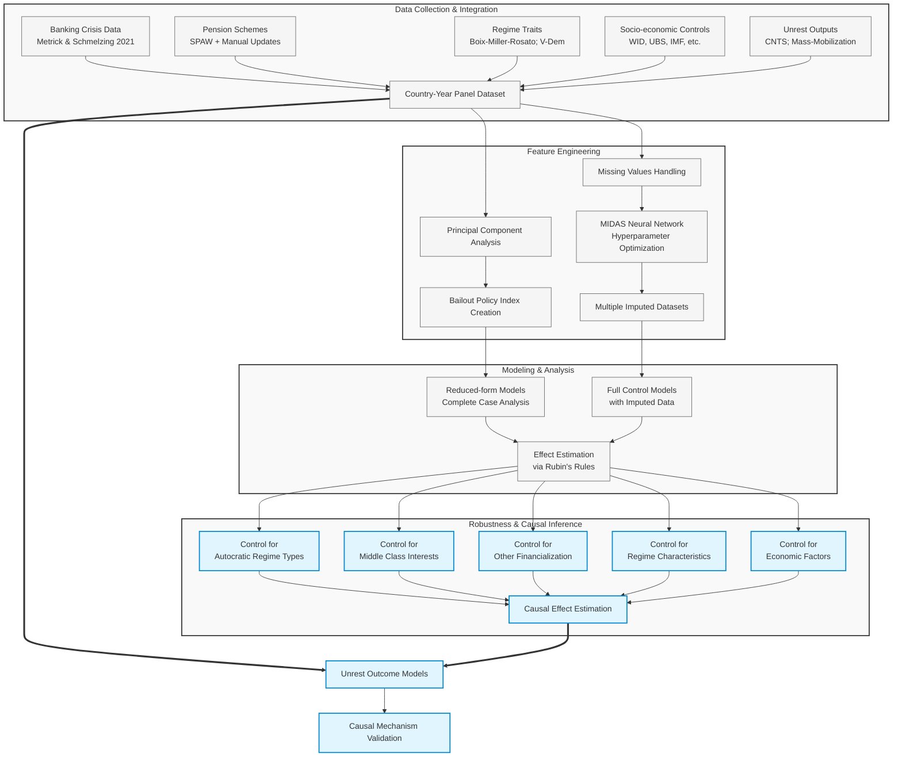
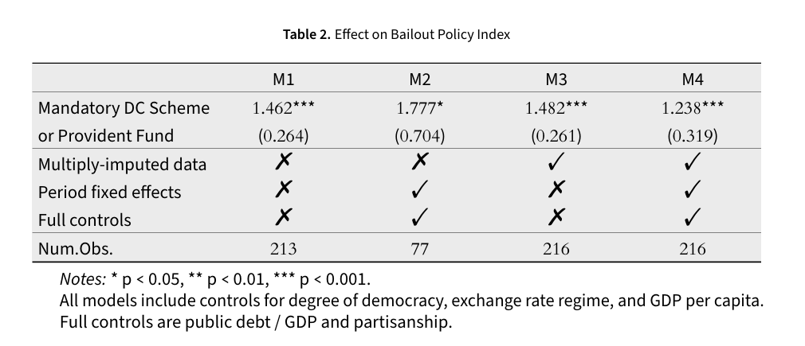
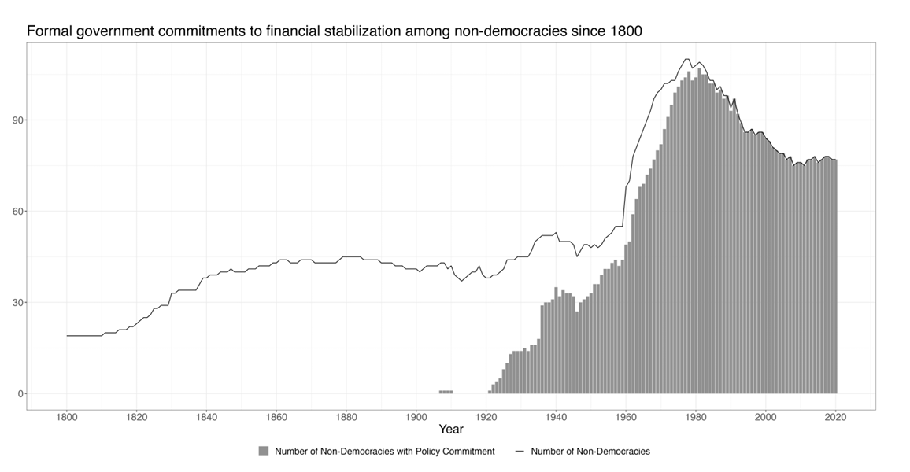
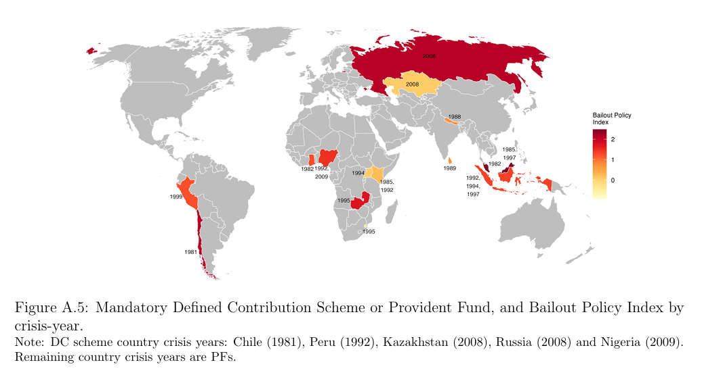
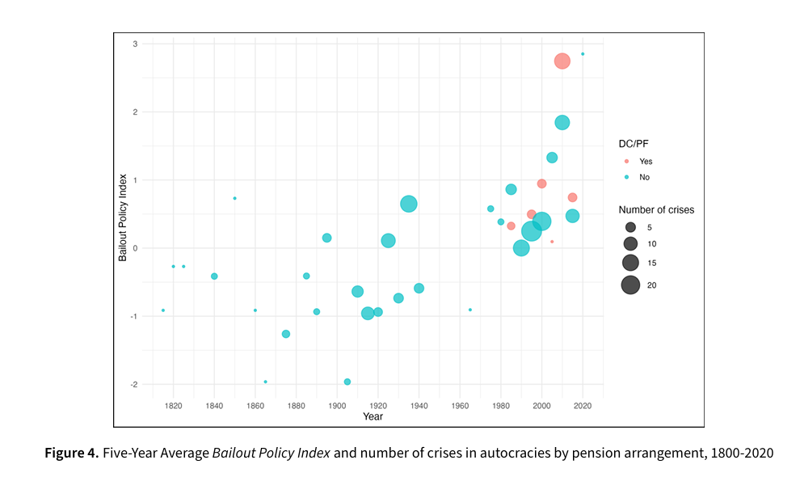
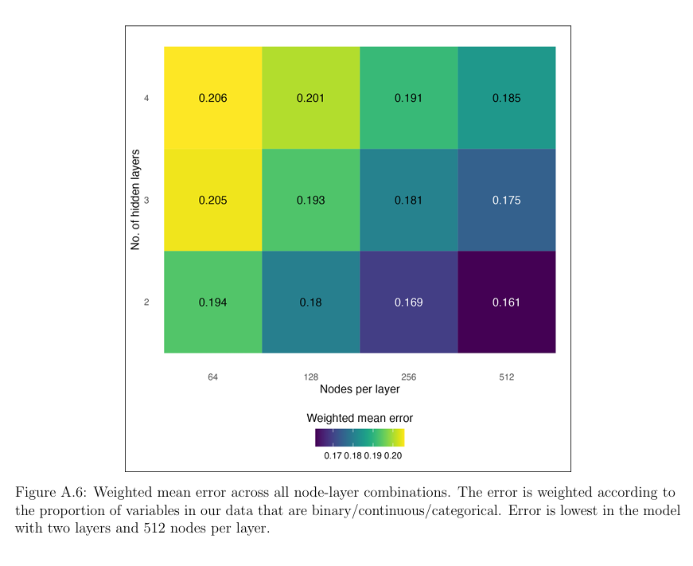
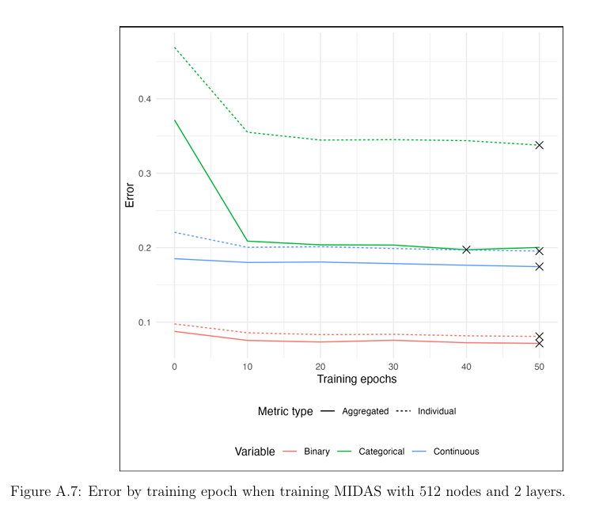

## Autocratic Bank Bailouts: Financialized Pensions, Mass Wealth Accumulation, and Regime Survival

## Key Summary

* **Question** When systemic banking crises strike, do autocracies that have *financialized* key supporters’ wealth via mandatory DC/PF pensions respond with more extensive bailouts, and does this insulate them from mass unrest?  
* **Finding** Yes. Exposure to DC/PF pensions raises a country’s *Bailout Policy Index* (BPI) by ~ +1.2 standard deviations **and** this presists through extensive checks against possible confounder variables.  
* **Mechanism** Bailouts protect pension-linked wealth, sustaining the “authoritarian bargain’’ and regime survival.

### Data Science Pipeline

* **Extensive feature engineering**
    * PCA to generate novel measure of bank bailouts during economic crises
    * MIDAS multiple imputation to fill in missing values in country-year dataset (neural network approach), optimizing hyperparameters for dataset
* **Multivariate Linear Regression with time-series controls** to effect of pension schemes in country-year dataset
    * Multi-stage models 
* **Isolation of causal effect** via extensive robustness checks, controlling for:
    * Autocratic regime type
    * Middle Class Interests
    * Financialization
    * Regime Characteristics (Corruption, Clientelism)
    * Captial Account Openness
    * IMF Interventions
    * Investment Competition and Peer Learning
    * Protest Activity

See the model flowchart






### Paper Abstract
Pension schemes provide autocratic regimes with an important strategic tool to curry the support of critical groups by enabling them to accumulate sizeable, deferred-access wealth. Yet, we argue, financialized pension schemes also impose political constraints on autocratic governments, incentivizing them to be more responsive to the interests of these supporters when severe banking crises put pension wealth at risk.

Employing a unique dataset of crisis policy interventions since 1800 and a state-of-the-art approach to multiple imputation, we show that autocratic regimes with financialized pension schemes provide more extensive bailouts during crises. These bailouts enhance regime resilience by limiting losses for scheme participants and reducing social unrest, reflecting the imperatives of regime survival and the implicit political bargain between the regime and its critical supporters.

### Data

Data is in country-year format and includes extensive data sources, these are documented in the [codebook](Non_Dems_Codebook.pdf)

#### Key Sources and Variables

| Theme | Dataset(s) | Coverage |
|-------|------------|----------|
| **Banking crises & policies** | Metrick & Schmelzing 2021 | 216 systemic events, 1800-2014 |
| **Pension design** | SPAW + manual updates | 1900-2020 |
| **Regime traits** | Boix-Miller-Rosato; V-Dem | 1800-2020 |
| **Socio-economic controls** | WID, UBS, IMF, Reinhart-Rogoff | 1800-2020 |
| **Unrest outputs** | CNTS (1815-2023); Mass-Mobilization (1990-2020) | 1815-2023 |






## Methodology

### Measurement and Data

#### Banking Crises
- Focus on **Systemic Banking Crises (SBCs)** characterized by severe losses and insolvencies
- Source: Metrick and Schmelzing (M&S) dataset, which provides the most comprehensive coverage of banking crises since antiquity
- Sample: 216 crises in 90 autocracies (118 pre-WWII, 98 post-WWII)
- 20 crises in 15 autocracies with mandatory DC schemes/PFs (all post-WWII)

#### Policy Response Classification
Policy responses are categorized along a continuum from Market (no intervention) to Socialization (full loss coverage):

1. **Bagehot Model**: Minimal taxpayer exposure, placing burden on banks, shareholders and creditors
   - Extends emergency lending to prevent illiquid but solvent banks from failing
   - Requires good collateral and penalty interest rates
   - Promotes closure of insolvent banks and private sector recapitalization

2. **Bailout Model**: Extensive use of taxpayer resources to avoid closure of some insolvent banks
   - Higher probability of taxpayer losses
   - Some bank closures and private sector losses still occur

#### Key Policy Response Indicators
Seven binary indicators based on M&S data in following areas:
1. **Lending**: Liquidity support that departs from Bagehot's rule
2. **Guarantees**: New/extended protection for asset or liability holders
3. **Capital Injections**: Public sector recapitalization of banks
4. **Asset Management**: Transfer of distressed assets to public entities
5. **Restructuring**: Intervention to mandate restructuring/resolution
6. **Rules**: Regulatory changes or suspensions (e.g., stock market closures, relaxed accounting rules)
7. **No Intervention**: Deliberate abstention from market interventions

#### Bailout Policy Index Construction
- Created using **principal component analysis (PCA)** to capture correlations in 7 binary indicators
- Derived from the first principal component (linear combination explaining most variance)
- Range: -1.96 to 3.96 (higher values = more coherent Bailout response)
- Mean: -0.37, standard deviation: 1.32

### Empirical Model Specification

The main empirical model is:
```
BailoutIndex(c,t) = β₀ + β₁MandatoryDC/PF(c,t-1) + β₂TimePeriodFE(c,t-1) + β₃X(c,t-1) + εᵢ
```

Where:
- c = country, t = year
- X(c,t-1) = vector of control variables
- β₃ = vector of associated controls (see below)
- εᵢ = error term

#### Control Variables
1. **Alternative Mass Wealth Measures**: Residential property prices, home ownership rates, domestic deposits, household debt
2. **Cronyism Proxies**: V-Dem clientelism index, corruption measures, bank loans to firms/private sector
3. **Institutional Structures**: Electoral autocracy measures, party-based regime indicators
4. **Economic Factors**: Log of per capita GDP, public debt burden, fixed exchange rate regime
5. **Political Factors**: Democracy measures (Polity), partisanship

#### Missing Data Strategy
1. Reduced-form and comprehensive specifications using complete case sample (M1-M2 Models)
2. Multiple imputation of missing values using MIDAS (2022) to preserve observations, see appendix for hyperparameter optimization results and strategy (M3-M4 models)

### Causal Mechanism Testing
- **Outcome Variables**: Mass mobilization and unrest following crisis interventions
- **Data Sources**:
  1. Cross National Time Series Archive (CNTS) (1815-2023): Anti-government demonstrations, strikes, riots
  2. Mass Mobilization Data Project (MM) (1990-2020): Broad protest actions
- **Model**: Country fixed-effects negative binomial regressions with controls for democracy, GDP per capita, economic growth, empowerment rights, physical integrity rights
- **Time Controls**: Cubic polynomial of time, lagged dependent variable

## Findings

### Primary Results: DC/PF Schemes Drive Extensive Bailouts



Our multivariate analysis confirms that autocratic regimes with mandatory DC schemes or PFs implement significantly more extensive bailouts during banking crises:

- **Significant Effect**: Across all model specifications, mandatory DC/PF schemes have a statistically and substantively significant positive effect on bailout propensity
- **Effect Size**: When compared to autocracies without such schemes, those with DC/PF schemes implement interventions that are **1.23 points higher** on the Bailout Policy Index (approximately one standard deviation)
- **Consistent Findings**: Similar magnitude of effect across reduced-form specifications and full controls with multiply-imputed data

### Illustrative Historical Examples

**Temporal Comparison - Chile**:
- Military-dominated governments responded differently to severe banking crises:
  - 1926 crisis: Minimal intervention (BPI score: -1.96) - authorities largely stood aside
  - 1976 crisis: Moderate intervention (BPI score: 1.11) - state guaranteed deposits when mortgage system became insolvent
  - 1981 crisis: Extensive bailout (BPI score: 2.09) - after introducing DC pension scheme in 1980, 22 banks were nationalized with extensive guarantees

**Cross-Country Comparison - Global Financial Crisis (2007-2009)**:
- Venezuela (no funded scheme): Non-interventionist approach (BPI score: -1.96)
- Russia and Nigeria (both with DC pension schemes): Extensive interventions (BPI scores: 2.09 and 2.21 respectively)
  - Both provided guarantees and capital injections
  - Nigeria set up an asset management company
  - Russia delivered liquidity support that departed from Bagehot's rule

### Robustness Checks

Our findings remain robust against numerous alternative explanations:

1. **Not simply capturing middle/urban class interests**
   - Effect persists when controlling for urbanization and tertiary education levels

2. **Not just a proxy for fiscal resources used in cronyist bailouts**
   - Effect holds net of GDP per capita and public debt burden measures
   - Not conditional on cronyist government-corporate linkages

3. **Not conditional on regime type**
   - Effect persists across party-based and electoral autocratic regimes

4. **Alternative samples and additional controls**
   - Robust to consideration of alternative samples of autocracies in V-Dem and Polity
   - Holds when controlling for IMF conditionality, capital account openness, and policy diffusion

5. **Alternative wealth forms**
   - No robust evidence that other forms of mass wealth financialization (e.g., housing) drive similar effects

### Causal Mechanism: Reducing Social Unrest

Our analysis of mass mobilization and unrest following policy interventions supports our theoretical mechanism:

- More extensive bailouts in countries with DC/PF schemes are associated with reduced incidents of mass mobilization and unrest
- This suggests that bailouts enhance regime resilience by limiting losses for pension scheme participants
- Effect observed in both CNTS data (1815-2023) and Mass Mobilization data (1990-2020)

These findings support our argument that autocratic regimes implement bailouts to secure their survival when financial crises threaten the accumulated pension wealth of critical supporters.
### Appendix

### Multiple imputation

MIDAS, a neural network-based multiple imputation method, was used to handle missing data in the time-series cross-sectional dataset spanning countries from 1800 to present. The data was first preprocessed by removing descriptive metadata and variables with low predictive power (outflux below 0.5), ultimately retaining 82 variables. To optimize the neural network architecture, a grid search was conducted testing 12 different configurations with 2-4 hidden layers and 64-512 nodes per layer, using an overimputation technique that artificially introduced 30% additional missingness to evaluate performance against known values.

The optimal model configuration was determined to be a "wide and shallow" architecture with 512 nodes across 2 layers, trained for 20 epochs with early stopping to prevent overfitting. Performance was measured using RMSE for continuous variables, binary error for binary variables, and softmax error for categorical variables. To ensure robust results, the model was tested across eight different random seeds with consistent outcomes. 100 imputed datasets were generated and a two-step procedure was used to determine the optimal number of imputations (m) for each model, ensuring efficient standard errors with a target coefficient of variation of 5%.   





rMIDAS fits a autoencoder neural network with a encoder, decoder and a bottleneck layer to generatively fill in missing values based on non-linear pattern recognitions in the original data. See Lall and Robinson (2022) for an in-depth exploration of the network architecture, including usage of dropout layers to yield variation in imputed datasets for an accurate reflection of uncertainties in data generation. The neural network approach of rMIDAS is a state-of-the-art for preserving uncertainty estimates and realistic imputation of missing values at scale. 

M3/M4 models utilize imputed datasets to estimate coefficients. This is done through the application of Rubin's rules, where m regression models are estimated for m completed datasets. Applications of Rubin's rules are in [step 2 of the multiple imputation scripts](MI_02_hyperparameter_optimization.R) and in [functions.R](functions.R).  

Generate imputed datasets using the scripts before proceeding with the M3/M4 model estimations. 

### Replication of Findings

Data is accessed through the structure specified in setup.R. The primary data is SBC_policy_response_in_non_democracies_january_2025.dta. The data is pre-processed. 

Utilize master.R for individual figure and table replications. Follow the descriptions there. 

